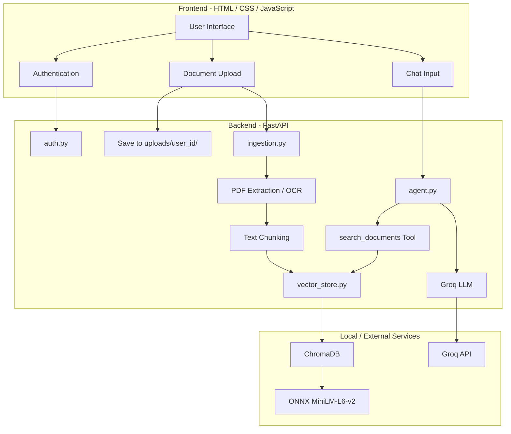

# Multi-Modal RAG Assistant 🤖📄🖼️

A privacy-focused, **zero-embedding-cost Multi-Modal Retrieval-Augmented Generation (RAG) Assistant** for chatting with your personal documents.

The application supports both **PDFs and images**, extracts their content locally, generates embeddings using a local ONNX model, and uses a Groq-powered LLM agent to intelligently decide when document retrieval is necessary.

> **Built for learning, experimentation, and portfolio use — with privacy and per-user data isolation as first-class design goals.**

---

## ✨ Key Features

### 📄 Multi-Modal Document Ingestion

Upload and index both:

* **PDF documents** using `PyPDF2`
* **PNG / JPG / JPEG images** using local `Tesseract OCR`

The extracted text is automatically split into chunks and added to the vector database.

### 🧠 Zero-Cost Local Embeddings

Embeddings are generated **locally** using:

* ChromaDB
* ONNX Runtime
* `all-MiniLM-L6-v2`

This means **no external embedding API is required** and your documents do not need to be sent to a third-party embedding service.

### 🔐 Per-User Data Isolation

The application is designed so that each user's documents remain isolated.

**File-level isolation**

```text
uploads/
├── user_1/
│   ├── document.pdf
│   └── image.png
│
└── user_2/
    ├── notes.pdf
    └── invoice.jpg
```

**Vector-level isolation**

Each vector contains a `user_id` metadata field, and document retrieval is restricted using ChromaDB filters:

```python
where={"user_id": {"$eq": user_id}}
```

This prevents one user's documents from being returned during another user's search.

### 🤖 Agentic Document Search

Instead of blindly performing vector retrieval for every question, the Groq-powered agent can decide whether it needs to search the user's documents.

The agent can:

1. Understand the user's question
2. Decide whether document retrieval is necessary
3. Call `search_documents`
4. Use retrieved context to generate the final answer
5. Respond directly when document search is unnecessary

### ⚡ Groq-Powered LLM

The project uses Groq's fast inference API with:

```text
llama-3.3-70b-versatile
```

The model is integrated through a custom tool-calling loop.

### 🔑 Simple Local Authentication

A lightweight SQLite authentication system is included for:

* User registration
* Login
* User-specific document storage
* User-scoped document search

### 🎨 Dark-Themed Web Interface

A simple single-page interface provides:

* Registration and login
* Drag-and-drop document uploads
* Uploaded document listing
* Chat with your documents
* Dark-themed UI

---

# 🏗️ Architecture



---

# 🔄 How It Works

The complete flow is approximately:

```text
User
  │
  ├── Register / Login
  │
  ├── Upload PDF / Image
  │
  ▼
FastAPI Backend
  │
  ▼
Document Ingestion
  │
  ├── PDF → PyPDF2
  │
  └── Image → Tesseract OCR
  │
  ▼
Text Chunking
  │
  ▼
ChromaDB
  │
  └── Local ONNX Embeddings
```

When the user asks a question:

```text
User Question
      │
      ▼
Groq Agent
      │
      ├── Answer directly
      │
      └── Call search_documents
                  │
                  ▼
             ChromaDB
                  │
          user_id filtering
                  │
                  ▼
          Relevant document chunks
                  │
                  ▼
              Groq LLM
                  │
                  ▼
             Final Answer
```

---

# 🛠️ Tech Stack

| Component         | Technology                      |
| ----------------- | ------------------------------- |
| Backend           | FastAPI                         |
| Frontend          | HTML / CSS / Vanilla JavaScript |
| Authentication    | SQLite                          |
| PDF Extraction    | PyPDF2                          |
| OCR               | Tesseract + pytesseract         |
| Vector Database   | ChromaDB                        |
| Embeddings        | all-MiniLM-L6-v2                |
| Embedding Runtime | ONNX Runtime                    |
| LLM               | Groq                            |
| LLM Model         | Llama 3.3 70B                   |
| Language          | Python                          |

---

# 🚀 Getting Started

## 1. Prerequisites

Make sure you have:

* Python **3.10+**
* Git
* Tesseract OCR

### Windows

Download and install Tesseract from:

https://github.com/UB-Mannheim/tesseract/wiki

Make sure the Tesseract installation directory is available in your system `PATH`.

Typical location:

```text
C:\Program Files\Tesseract-OCR
```

### macOS

```bash
brew install tesseract
```

### Ubuntu / Debian

```bash
sudo apt-get update
sudo apt-get install tesseract-ocr
```

---

# 📥 Installation

### 1. Clone the repository

```bash
git clone https://github.com/dev-x-infinite/Multi-Model_Rag.git
cd Multi-Model_Rag
```

### 2. Create a virtual environment

```bash
python -m venv venv
```

### 3. Activate the environment

**Windows**

```bash
.\venv\Scripts\activate
```

**macOS / Linux**

```bash
source venv/bin/activate
```

### 4. Install dependencies

```bash
pip install -r requirements.txt
```

### 5. Configure environment variables

Create a `.env` file in the project root:

```env
GROQ_API_KEY=your_groq_api_key_here
```

---

# ▶️ Running the Application

Start the FastAPI development server:

```bash
uvicorn main:app --reload
```

Then open:

```text
http://127.0.0.1:8000
```

### Using the application

1. Create an account.
2. Log in.
3. Upload a PDF or image.
4. Wait for ingestion to complete.
5. Ask questions about your uploaded documents.
6. The agent will determine when document retrieval is required.

---

# 📁 Project Structure

```text
Multi-Model_Rag/
│
├── main.py
├── auth.py
├── ingestion.py
├── vector_store.py
├── agent.py
├── demo.py
├── requirements.txt
├── .env
├── users.db
│
├── uploads/
│   └── <user_id>/
│
└── static/
    └── index.html
```

### `main.py`

FastAPI application entry point.

Handles:

* Authentication endpoints
* File uploads
* Search
* Chat
* Health checks

### `auth.py`

SQLite-based authentication logic for user registration and login.

### `ingestion.py`

Responsible for:

* Detecting file types
* Extracting PDF text
* Running OCR on images
* Chunking extracted text

### `vector_store.py`

Wrapper around ChromaDB responsible for:

* Collection initialization
* Embedding storage
* Vector search
* Metadata filtering
* User-level isolation

### `agent.py`

Contains:

* Groq client integration
* LLM configuration
* Tool schemas
* Agent system prompts
* Tool-calling loop

### `static/index.html`

Contains the frontend UI, CSS, and JavaScript logic.

### `demo.py`

A lightweight CLI utility for testing ingestion and vector search functionality.

---

# 🔐 Security & Privacy Notes

This project is primarily an **educational / portfolio project** and is **not production-ready** in its current form.

### ⚠️ Plain-Text Passwords

Passwords are currently stored directly in SQLite.

A production implementation should use a secure password hashing algorithm such as:

* Argon2
* bcrypt

### ⚠️ Client-Supplied User Identity

The current implementation uses local storage and a `user_id` value supplied by the client.

This should not be trusted in a production application.

A production system should use:

* Secure session cookies, or
* JWT-based authentication
* Proper authorization middleware

### ⚠️ Tesseract Configuration

If Tesseract is not available in your system `PATH`, image ingestion will fail.

Make sure the OCR executable is correctly installed and configured.

### ⚠️ External LLM Processing

Although embeddings and document indexing are performed locally, retrieved document context may be sent to the **Groq API** when the agent generates an answer.

Do not upload sensitive documents unless you understand the data handling policies of the services you use.

---

# 🧪 Educational Goals

This project demonstrates several important concepts in modern AI application development:

* Retrieval-Augmented Generation
* Multi-modal document ingestion
* OCR pipelines
* Vector databases
* Local embeddings
* Tool-calling agents
* FastAPI backend development
* User-level data isolation
* LLM-based document search
* Full-stack AI application architecture

It is also a good starting point for experimenting with more advanced RAG architectures.

---

# 🗺️ Roadmap

Some improvements that could be added in future versions:

* [ ] Secure password hashing
* [ ] JWT / session-based authentication
* [ ] Role-based authorization
* [ ] Better document management
* [ ] Document deletion
* [ ] Multiple vector collections
* [ ] Improved chunking strategies
* [ ] Metadata-aware retrieval
* [ ] Hybrid search
* [ ] Reranking
* [ ] Conversation history
* [ ] Streaming LLM responses
* [ ] Docker support
* [ ] Automated tests
* [ ] Production deployment configuration
* [ ] Support for additional document formats
* [ ] Better OCR for complex documents and tables

---

# 🤝 Contributing

Contributions are **very welcome!**

Whether you want to fix a bug, improve the UI, optimize retrieval, add a new document type, improve security, or experiment with a different RAG technique, feel free to contribute.

### How to contribute

1. Fork the repository.
2. Create a new branch:

```bash
git checkout -b feature/my-feature
```

3. Make your changes.
4. Test your changes locally.
5. Commit your work:

```bash
git add .
git commit -m "Add my feature"
```

6. Push your branch:

```bash
git push origin feature/my-feature
```

7. Open a Pull Request.

### 💡 Ideas for Contributions

You can contribute by working on areas such as:

* Improving retrieval quality
* Adding support for new file formats
* Improving OCR accuracy
* Implementing hybrid search
* Adding reranking models
* Improving the UI/UX
* Adding authentication security
* Writing tests
* Improving documentation
* Dockerizing the project
* Adding observability and logging
* Optimizing ChromaDB queries
* Experimenting with different LLMs

Even **small improvements, bug fixes, documentation updates, and suggestions are appreciated.**

---

# 🌟 Support the Project

If you find this project useful or interesting:

⭐ **Star the repository**

🍴 **Fork the project**

🐛 **Open an issue**

🔧 **Submit a pull request**

💡 **Share ideas and improvements**

Every contribution helps make the project better.

---

# 📜 License

This project is intended for educational and experimental purposes.

Add the appropriate license file to the repository before distributing or using the project commercially.

---

## 👨‍💻 Author

Built as a learning project around **Multi-Modal RAG, local embeddings, vector databases, and agentic AI**.

Contributions, feedback, and ideas are welcome! 🚀

> **Have an idea that could make this RAG assistant better? Open an issue or submit a PR — let's build it together.**
