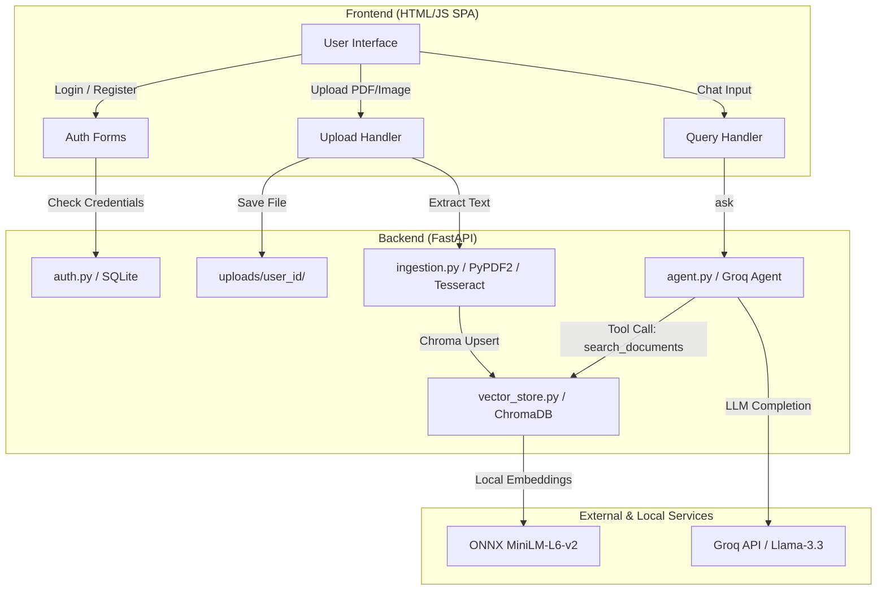

# Multi-Modal RAG Assistant 🤖📄🖼️

A privacy-focused, zero-embedding-cost **Multi-Modal Retrieval-Augmented Generation (RAG)** assistant. It runs local semantic embeddings and indexes document text from both PDFs and images (using OCR), providing strict **per-user data isolation** and utilizing Groq's free-tier tool-calling agents to converse with the documents.

---

## 🚀 Key Features

*   **Multi-Modal Ingestion**: Automatically detects and extracts text from PDFs (via local `PyPDF2` parser) and Images (via local `pytesseract` OCR).
*   **Zero-Cost Local Embeddings**: Uses ChromaDB's built-in ONNX runtime running `all-MiniLM-L6-v2` locally. No external API calls are made for embedding calculation.
*   **Per-User Isolation**: 
    *   **Disk Storage Isolation**: Uploaded files are sorted under user-specific subdirectories (`uploads/<user_id>/`).
    *   **Vector Database Isolation**: Embeddings are prefixed with `user_id` inside Chroma, and search is enforced at the database level using Chroma's query filters (`where={"user_id": {"$eq": user_id}}`).
*   **Agentic Search Decision**: Integrates Groq's `llama-3.3-70b-versatile` using tool-calling. The assistant decides dynamically whether to call `search_documents` or answer directly based on context.
*   **Simple Local Authentication**: A lightweight SQLite-based registration and login system.
*   **Beautiful Dark-Themed Web UI**: A clean, single-page UI allowing users to register, log in, drag-and-drop documents, view their ingested files, and chat with their isolated knowledge base.

---
## 📐 Architecture Flow

The following diagram illustrates how raw documents, queries, and user scopes flow between the frontend, backend, and local/external services:



## 🛠️ Prerequisites & Setup

### 1. System Requirements

*   **Python 3.10+**
*   **Tesseract OCR Engine** (Required for processing images like PNG/JPG/JPEG):
    *   **Windows**: Download and run the installer from [UB Mannheim's Tesseract wiki](https://github.com/UB-Mannheim/tesseract/wiki). Ensure you add Tesseract to your System Environment variables (e.g., `C:\Program Files\Tesseract-OCR`).
    *   **macOS**: Install via Homebrew: `brew install tesseract`
    *   **Linux (Ubuntu/Debian)**: `sudo apt-get install tesseract-ocr`

### 2. Installation Steps

1.  **Clone the Repository**:
    ```bash
    git clone https://github.com/dev-x-infinite/Multi-Model_Rag.git
    cd Multi-Model_Rag
    ```

2.  **Create and Activate a Virtual Environment**:
    ```bash
    python -m venv venv
    # On Windows:
    .\venv\Scripts\activate
    # On macOS/Linux:
    source nv/bin/activate
    ```

3.  **Install Python Dependencies**:
    ```bash
    pip install fastapi uvicorn python-multipart pydantic PyPDF2 pytesseract pillow chromadb groq python-dotenv
    ```

4.  **Configure Environment Variables**:
    Create a `.env` file in the root directory:
    ```env
    GROQ_API_KEY=your_groq_api_key_here
    ```

---

## 🚦 How to Run

1.  **Start the FastAPI Server**:
    ```bash
    uvicorn main:app --reload
    ```
2.  **Open the Web Interface**:
    Navigate to `http://127.0.0.1:8000` in your web browser.
3.  **Use the App**:
    *   Click **Register** to create a new user profile.
    *   Log in with your credentials.
    *   Drag-and-drop a PDF or an image to the sidebar.
    *   Start chatting! The assistant will automatically query your uploaded document index if you ask questions related to your files.

---

## 📁 Project Structure

*   [main.py]: Entry point for the FastAPI server, exposing authentication, upload, search, and health endpoints.
*   [auth.py]: Simple SQLite table initialization and database functions for authenticating user accounts.
*   [ingestion.py]: Routing logic to extract raw text from PDF and Image file uploads, using sliding-window chunking.
*   [vector_store.py]: Direct wrapper for ChromaDB. Manages collection initialization, document embedding upsert, and metadata queries with user scope.
*   [agent.py]: Holds the Groq client integration, system prompts, function schemas, and the custom tool loop.
*   [static/index.html]: HTML, CSS (Vanilla dark mode layout), and JavaScript Frontend that interacts with the backend.
*   [demo.py]: Simple CLI diagnostic script to check local ingestion and search sanity.

---

## ⚠️ Important Educational Notes (Security & Scale)

This project was built as a portfolio learning exercise. Note the following design choices before attempting to deploy it publicly:
1.  **Authentication**: Passwords are saved in **plain text** inside `users.db` SQLite database. No password hashing (such as `bcrypt` or `argon2`) is utilized.
2.  **Token Sessions**: The web app uses simple localStorage values to keep track of who is logged in and sends that username directly as `user_id` header in HTTP forms. No JWT or secure session cookies are implemented.
3.  **Tesseract Pathing**: Ensure your system's `PATH` contains the directory pointing to the `tesseract` binary, otherwise `pytesseract` will raise a executable not found error.
